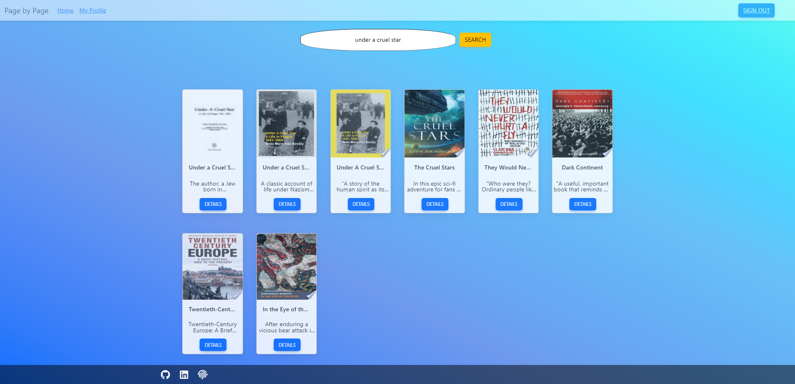
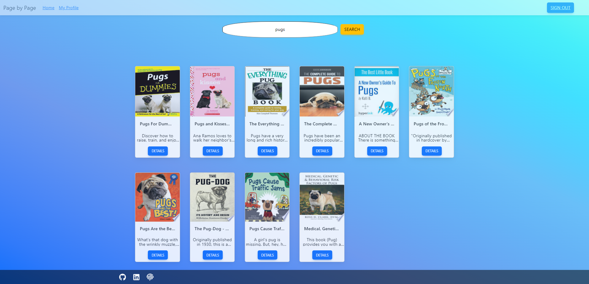
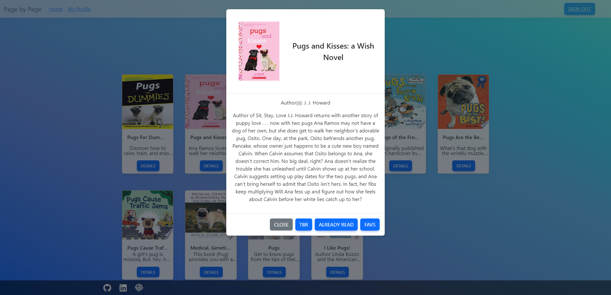

# Page By Page Client-Side Application

Page By Page is a web application that is designed to allow you to search for books and create a personalized bookshelf. Customize your profile by adding books to the TBR (To Be Read), Read, or Favorites bookshelf. From your bookshelves, you can click to preview the selected book on Google Books. The application is built using JavaScript, HTML, and CSS. This repository contains the client-side code for the Page By Page application. Access the site [here](https://main.d2sh501brp4jaq.amplifyapp.com/)!

## Tech Stack

The Page By Page client-side application is built using the following technologies:

- **React**: The application is built using the React JavaScript library, which is used for building user interfaces.
- **Redux**: Redux is used for state management in the application, allowing the application's data to be managed in a single, centralized location.
- **React Router**: React Router is used for client-side routing in the application, allowing the application to have multiple views without requiring a page refresh.
- **Bootstrap**: Bootstrap is used for styling the application's user interface, providing a responsive and modern design.
- **Git**: Git is used for version control, allowing the development team to collaborate on the application's codebase.

## Features

The Page By Page application is designed to be a user-friendly and efficient way for people to search and save books online.

### User Authentication

Users are able to create an account and log in to access the application's features. This application uses Redux for user authentication, allowing users to securely log in and access the application's features.

### Bookshelf

The user's profile is where the bookshelves can be found, and users can view the list of books they have added to their collection. The bookshelf shows book covers, titles, authors, and a small snippet of the description. Users can click on a book to view more information about it or preview the book on Google Books.

### Book Search

Users can search for books by title or author and add them to their bookshelf. Book results are provided by Google Books API.

### Progress Tracking

The application allows users to track books that they have already read, books they would like to read, and their favorites.

## Future Development

- Implement a dark mode feature for users who prefer low-light settings.
- Improve the search feature to allow users to search by genre, publication date, and other criteria.
- Allow users to leave ratings and reviews for books they have read.
- Implement a social feature that allows users to share their reading progress and book recommendations with friends.
- Expand the selection of supported languages.

## Screenshots

Landing Page

Register Page

Login Page

Home Page

Author Search Result

Title Search Result

Subject Search Result

Book Details

Dashboard

Saved Book Results

Update Account

